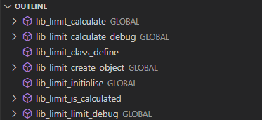
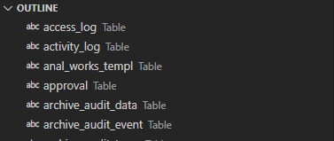

# SampleManager(R) development extension

This extension can be used to help you with SampleManager VGL deployment.

## Features

### vgl coding

Simple syntax highlighting is provided.
Also the functions as they where found in the report will be shown in the outline box

## structure file

Simple syntax highlighting is provided.
Also the tables where shown in the outline box

## Requirements

FOr the full functionality a SampleManager installation should ve available.
This extension set was only tested with versions higher than 12.1.

## Extension Settings

This extension contributes the following settings:

* `sampleManager.Instance.Name`: Name of the SampleManager Instance
* `sampleManager.Instance.Folder`: Folder of the SampleManager Instance
* `sampleManager.Installation.Folder`: Folder of the SampleManager Base Installation
* `sampleManager.Installation.Version`: Version of SampleManager being installed

## Known Issues

Calling out known issues can help limit users opening duplicate issues against your extension.

## Release Notes

Users appreciate release notes as you update your extension.

### >1.0.0
beta release!!!
Once the first version/release is created, the subsequent minor versions will be described here
Until the first version (1.0.0) I will add functionality as finalised the piece of codeing.
