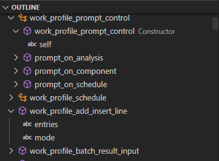
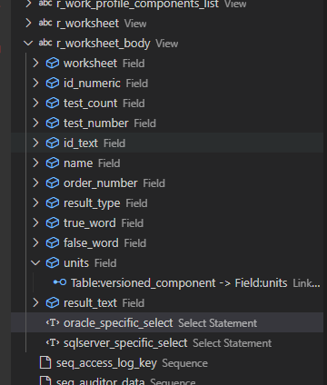

# SampleManager\(R\) development extension

  

This extension can be used to help you with SampleManager VGL deployment.

## Features

### vgl coding

Simple syntax highlighting is provided. The Outline Box will show the classes and the corresponding functions.

The class functions will be renamed according to the classes.

_class\_action\_function_ will be shown as _function_ while classname and action keyword is being removed from outline.

Constructor will have the same name as the class, while _class\_initialisation_ is being removed.

## structure file

Simple syntax highlighting is provided. Also the tables where shown in the outline box

## Requirements

For the full functionality a SampleManager installation should ve available. This extension set was only tested with versions higher than 12.1.

## Extension Settings

This extension contributes the following settings:

* `sampleManager.Instance.Name`: Name of the SampleManager Instance
* `sampleManager.Instance.Folder`: Folder of the SampleManager Instance
* `sampleManager.Installation.Folder`: Folder of the SampleManager Base Installation
* `sampleManager.Installation.Version`: Version of SampleManager being installed

## Known Issues

Calling out known issues can help limit users opening duplicate issues against your extension.

## Release Notes

Users appreciate release notes as you update your extension.

### &gt;1.0.0

beta release!!!

Once the first version/release is created, the subsequent minor versions will be described here

